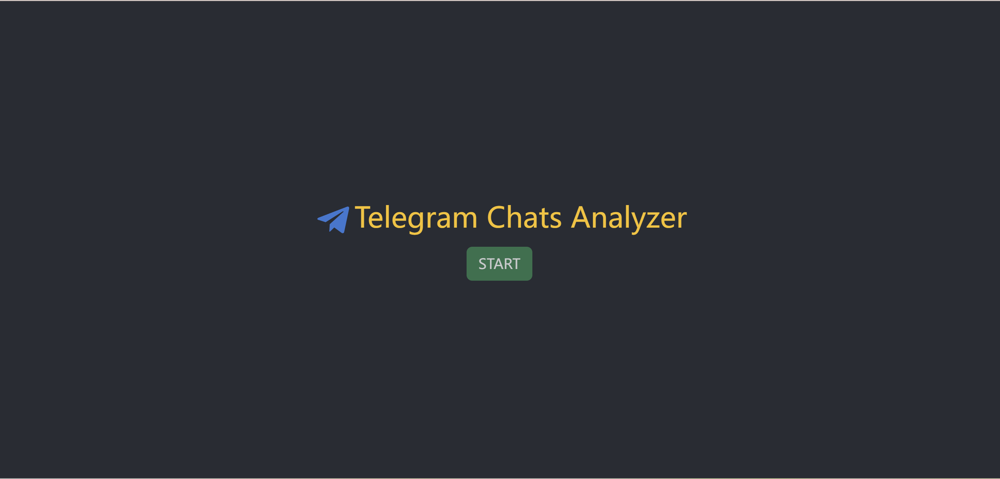
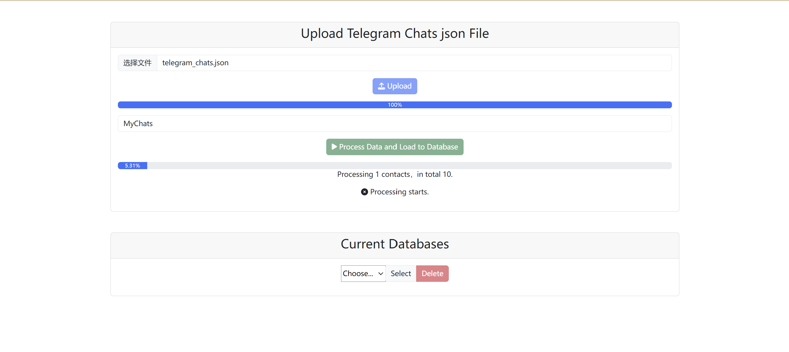
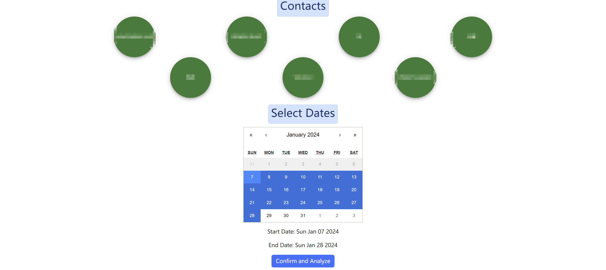
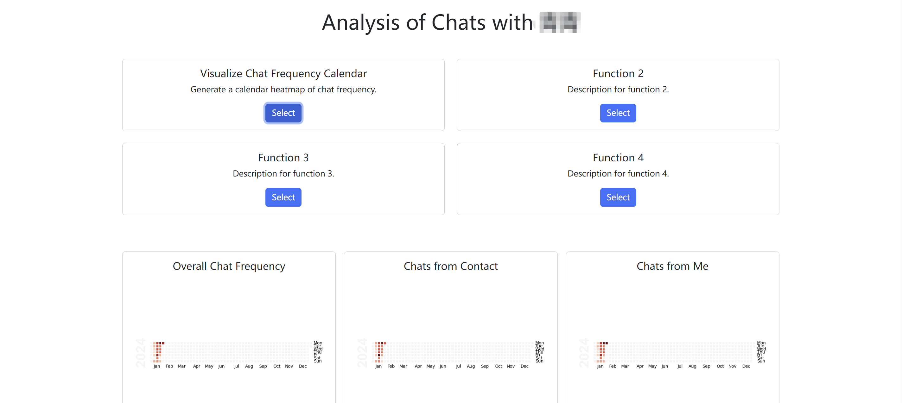

# telegram-chats-analyzer
Want an annual summary of your telegram chats with your best friend or lover?

Here is a web app for you to analyze and visualize telegram chats!

## Setup

### Frontend (client)

- Ensure that you have set up Node and npm.

- Download the repo by running
  
  `git clone https://github.com/mikelovesolivia/telegram-chats-analyzer.git`
  
- Go to the project folder and download the required packages by running

   ```
    cd client
    npm install
   ```


### Backend (server)

- Python version: 3.12.
- Set up the python environment by going to the project folder and running
  ```
  cd server
  pip install -r requirements.txt
  ```
- Download [PostgreSQL](https://www.postgresql.org/download/), which is used as the project database. Use Ubuntu 22.04 as an example here:
  ```
  sudo apt update
  sudo apt install postgresql postgresql-contrib
  sudo systemctl start postgresql.service
  ```
- Reset password and create a database named `chats` in PostgreSQL.
  ```
  sudo systemctl start postgresql.service
  sudo -i -u postgres
  createdb chats
  psql
  ALTER USER postgres WITH PASSWORD 'Your_Password';
  exit
  ```

  
### Export Telegram Chats

Please refer to this [link](https://telegram.org/blog/export-and-more) and export your chats in json format.


## Run the Application

Open two terminals at the project folder, and run the following commands respectively:

### Start the Frontend

```
  cd client
  npm start
```

And the application will automatically shown in a browser. Or you can visit the webpage at http://localhost:3000.


### Start the Backend

First, please open `app.py` and `process_chat.py`, change the username and password of PostgreSQL database to your own username and password.

```
  cd server
  python app.py
```

Then the server will be started.


## How to Use

When you start the app, you will be directed to the welcome page in the browser:



After clicking on "START", you will see the start page where you can upload your chats files (json). 

Just select your chats file, upload, enter a table name for your chats, and click on "process data", the chat data will be processed to a standard format and loaded to the database:



After refreshing, you will see your chat table created. 

You can choose a chat table and have a quick preview of its first 10 rows.


You can either click on "Delete" to delete the table from the database or click on "Select" to use the chat data for analysis.

If you choose "select", you will be directed to a page where all of your contacts are shown.

Simply click on the contact whose chats you want to analyze, you will see a calendar showing all dates when you have at least a chat!

Now, you can select the start and end dates of your chats, and click "Confirm and Analyze"



Then you will go to the analysis page. Currently we only have a chat frequency heatmap calendar for you. Click on the "Select" button in the "Visualize Chat Frequency Calendar" card, and you will see your heatmap calendar!



More functions are in progress. Hope you can have fun!

## Work in Progress

- Add more functions like sentiment visualization, an interactive interface to view a chat annual summary, a rigorious statistical analysis of chats, and even incorporating ChatGPT to learn to chat like your selected contact! And ..., more!
- Beautify the web style and make it more user-friendly.
- Deploy the website on the internet for you to use more easily!

Thank you, hope you will have fun! :) 


## Tools Used:

- Frontend
  - HTML, CSS, Bootstrap, JavaScript, React, Node, npm, axios

- Backend
  - Python, Flask, PostgreSQL, Pandas
